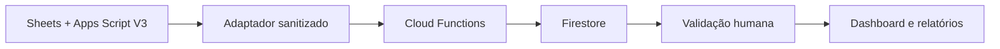

# WMGJ App Foundation

> Clinical-readiness only: clinical use, patient communication, production
> deployment and real-data migration are disabled.

MVP operacional para migrar gradualmente a base-mestra WMGJ para Cloud Firestore sem interromper o pipeline V3 atual.

## Entrega atual

- dashboard React/TypeScript responsivo, com dados demonstrativos sanitizados;
- contrato de ações validado no backend;
- Cloud Functions para comandos idempotentes e projeção de fontes;
- classificação opcional com OpenAI Structured Outputs, limitada a metadados não sensíveis;
- Firestore e Storage com negação por padrão e escrita de domínio somente pelo backend;
- trilha de auditoria encadeada por hash;
- regras, índices, emuladores, seed e testes automatizados;
- plano de migração incremental, mantendo Sheets/Apps Script como sistema vigente até o aceite de cada fase.

Este MVP é estritamente operacional e não clínico. Dados identificáveis, prontuários, diagnósticos, OCR bruto e qualquer PHI ficam fora desta entrega.

## Fluxo



O frontend pode ler projeções autorizadas. Toda mutação relevante passa pelas funções, com Auth, App Check, MFA quando exigido, autorização por tenant, idempotência e auditoria.

## Executar localmente

Requisitos: Node.js 22+, npm e Java 21 para o Emulator Suite.

```bash
cd app-foundation
npm ci
cp .env.example .env.local
npm run build
npm test
```

Para testar as regras no emulador:

```bash
npm run test:rules
```

Para subir a interface:

```bash
npm run dev
```

A interface desta entrega permanece deliberadamente demonstrativa. As variáveis Firebase apenas preparam os adaptadores cliente; a troca para dados autenticados pertence à F3. O projeto de produção não é criado nem implantado por este repositório.

## Antes de criar o Firestore de produção

1. confirmar a região `southamerica-east1`;
2. decidir se CMEK é requisito contratual;
3. configurar Secret Manager, IAM mínimo, Auth, App Check e MFA;
4. validar regras e isolamento entre tenants em homologação;
5. definir retenção, backup/PITR, logs de auditoria e procedimento LGPD;
6. cadastrar `OPENAI_API_KEY` somente no Secret Manager, caso a classificação seja habilitada.

## Estrutura principal

```text
app-foundation/
  api/                 contrato FastAPI sintético e somente leitura
  functions/src/       backend e contratos
  src/                 dashboard e adaptadores cliente
  tests/               contratos e Security Rules
  scripts/migration/   dry-run sintético sem I/O externo
  docs/                arquitetura e migração
  firestore.rules      autorização de leitura
  storage.rules        objetos privados
  firebase.json        emuladores e deploy
```

Consulte [Arquitetura Firestore](docs/FIRESTORE_ARCHITECTURE.md) e [Plano de migração](docs/MIGRATION_PLAN.md).
