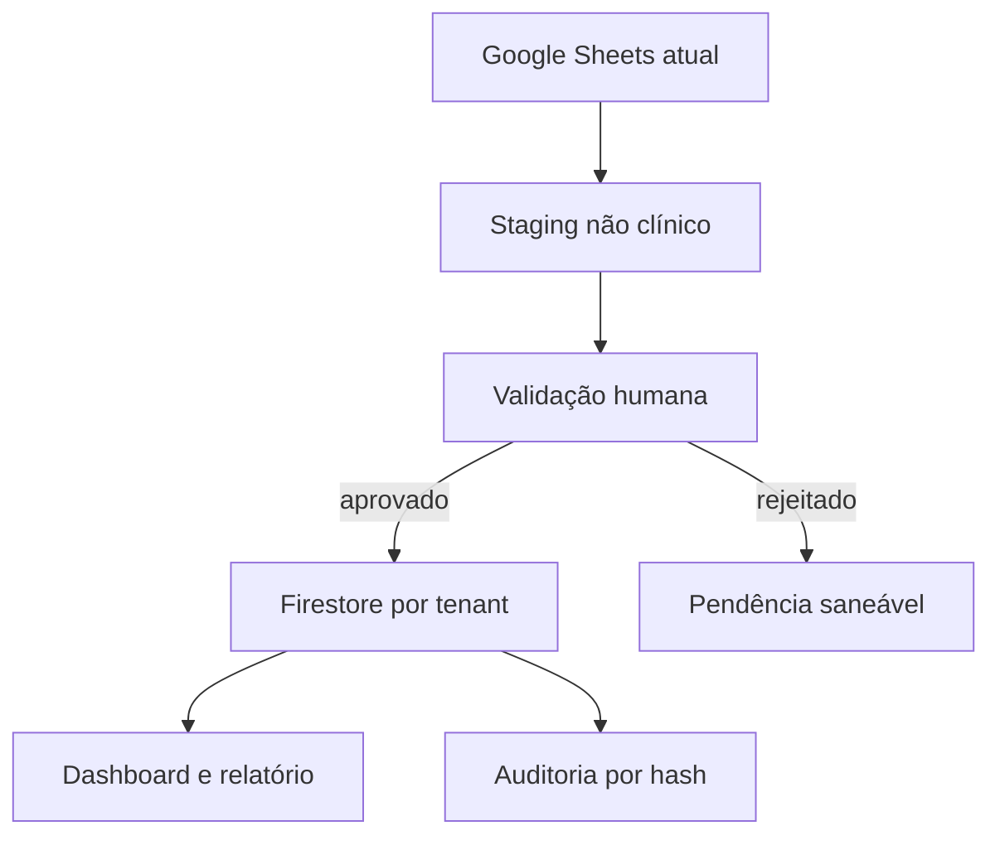

# Arquitetura Firestore — base-mestre operacional WMGJ/JFN

**Status:** contrato da fundação MVP

**Versão:** 1.0

**Escopo:** operação administrativa e auditoria não clínica

## 1. Limite de escopo obrigatório

Este MVP é deliberadamente **não clínico e sem PHI/dados pessoais de saúde**.

São permitidos apenas metadados operacionais e empresariais, como situação de processamento, tipo documental sanitizado, competência, presença de valor, contagens agregadas, contratos, produção consolidada, qualidade e trilha técnica.

São proibidos no Firestore, no Storage, nas planilhas de staging, em prompts, logs, IDs e nomes de arquivos deste MVP:

- nome de paciente, CPF, CNS, data de nascimento ou endereço;
- diagnóstico, evolução, prescrição, laudo ou observação clínica;
- procedimento, glosa, OPME ou produção vinculada a uma pessoa identificada ou identificável;
- OCR integral de documento que possa conter dados de saúde;
- assunto de e-mail ou nome original de arquivo que contenha identificadores.

O `uid` do Firebase Authentication pode aparecer na trilha de autoria por necessidade de controle de acesso, mas não deve ser acompanhado de nome, e-mail ou atributo clínico nos documentos de domínio.

Qualquer expansão clínica exige projeto separado, avaliação formal de privacidade e segurança, novo contrato de dados e aprovação de governança. Não é uma continuação automática deste MVP.

## 2. Decisões que antecedem a criação do banco de produção

### 2.1 Região

- O banco de produção deve ser criado em `southamerica-east1` (São Paulo).
- As Cloud Functions v2 já declaram `southamerica-east1` em `functions/src/index.ts`.
- A região do Firestore é escolhida na criação e não pode ser alterada depois.
- Se o banco padrão de um projeto já tiver sido criado em outra região, ele não deve ser promovido a produção; deve-se criar banco ou projeto adequado e migrar de forma controlada.

Referência: [Cloud Firestore locations](https://firebase.google.com/docs/firestore/locations).

### 2.2 Criptografia e CMEK

O Firestore cifra dados em repouso com chaves gerenciadas pelo Google por padrão. Antes da criação do banco de produção deve existir uma decisão registrada:

1. **MVP com criptografia gerenciada pelo Google**, se aceita pela governança; ou
2. **CMEK**, se houver requisito contratual ou regulatório específico e a funcionalidade estiver disponível para o projeto.

CMEK só pode ser configurada na criação de um banco novo; não pode ser habilitada retroativamente no banco existente. A decisão, o responsável pelas chaves, a rotação e o plano de indisponibilidade devem ser aprovados antes do provisionamento.

Referência: [CMEK for Firestore](https://firebase.google.com/docs/firestore/cmek).

### 2.3 Ambientes

Dev/emulador, homologação e produção devem usar projetos distintos. Nenhum dado real deve ser usado no emulador. O identificador de projeto de demonstração atual é `wmgj-master-data-demo`.

## 3. Fluxo operacional do MVP



Princípios:

- o Sheets permanece somente leitura durante extração e dupla operação;
- nenhum registro vai diretamente do Sheets para a coleção final;
- todo registro final possui aprovação humana, lote, hash e origem;
- rejeição ou correção não apaga o candidato original;
- repetição do mesmo lote não pode duplicar resultado;
- dashboards recebem somente medidas agregadas.

O detalhamento das fases está em [MIGRATION_PLAN.md](./MIGRATION_PLAN.md).

## 4. Fronteira de confiança

O navegador usa Firebase Authentication e pode ler somente superfícies explicitamente liberadas por `firestore.rules`. Escritas críticas usam callable Functions.

Toda escrita de domínio deve seguir:

1. Firebase Authentication;
2. App Check;
3. validação estrita do payload com Zod;
4. leitura da associação `tenants/{tenantId}/members/{uid}`;
5. verificação de status, expiração, permissão e `siteId`;
6. MFA quando a ação for privilegiada;
7. transação Firestore;
8. registro de auditoria na mesma transação.

As SDKs administrativas ignoram Security Rules. Por isso, regras do cliente não substituem `authorizeInTransaction`, IAM mínimo e separação de contas de serviço.

Referências: [Security Rules structure](https://firebase.google.com/docs/firestore/security/rules-structure) e [Firestore IAM](https://firebase.google.com/docs/firestore/security/iam).

## 5. Collections efetivamente presentes na fundação atual

### 5.1 Escrita backend implementada

| Caminho | Estado atual | Responsabilidade |
|---|---|---|
| `tenants/{tenantId}` | contrato e seed | raiz multiempresa; leitura apenas por membro ativo |
| `tenants/{tenantId}/members/{uid}` | autorização, Rules e seed | papéis, permissões, sites, expiração e revisão |
| `tenants/{tenantId}/action_requests/{keyHash}` | implementado | solicitação operacional criada por `requestOperationalAction` |
| `tenants/{tenantId}/idempotency/{keyHash}` | implementado | bloqueio de repetição por HMAC e hash do comando |
| `tenants/{tenantId}/audit_events/{eventId}` | implementado | evento append-only com cadeia de hash |
| `tenants/{tenantId}/aggregate_heads/{headId}` | implementado | sequência e cabeça da cadeia por agregado |
| `tenants/{tenantId}/sources/{sourceId}` | Rules e trigger implementados | metadado sanitizado de fonte; criação ainda depende de backend/migração |
| `tenants/{tenantId}/processing_runs/{runId}` | implementado pelo trigger | execução determinística criada por `onSourceCreated` |

### 5.2 Superfícies preparadas, ainda sem fluxo produtivo completo

| Caminho | Estado atual | Lacuna antes de produção |
|---|---|---|
| `tenants/{tenantId}/validation_tasks/{taskId}` | Rules, índices, teste e seed | falta criador/decisor produtivo e decisão append-only |
| `tenants/{tenantId}/dashboard_snapshots/{snapshotId}` | Rules, índice, seed e leitura web | falta projetor produtivo a partir de registros aprovados |
| `tenants/{tenantId}/reports/{reportId}` | Rules e índice | falta gerador, aprovação e versionamento |
| `source_versions` | somente exemption de índice | collection e writer não implementados |
| `extractions` | somente exemption de índice | fora do fluxo atual |
| `classifications` | somente exemption de índice e utilitário sanitizado | classificador ainda não está conectado a um worker persistente |

Essa distinção é normativa: documentação e interface não devem anunciar como operacional o que está apenas reservado por regras ou índices.

## 6. Collections planejadas exclusivamente para a migração

Estas collections pertencem às fases F1–F3 e ainda não estão implementadas:

| Caminho | Mutabilidade | Finalidade |
|---|---|---|
| `tenants/{tenantId}/migration_batches/{batchId}` | append-only após fechamento | manifesto do snapshot Sheets, contagens e hashes |
| `tenants/{tenantId}/staging_records/{recordId}` | versionado | candidato sanitizado ainda não válido como fato operacional |
| `tenants/{tenantId}/validation_decisions/{decisionId}` | append-only | aprovação, rejeição ou correção humana |
| `tenants/{tenantId}/migration_commits/{commitId}` | append-only | vínculo entre decisão aprovada e documento final |
| `tenants/{tenantId}/migration_reconciliations/{id}` | append-only | comparação de origem, staging e destino |

Clientes não escreverão diretamente nessas collections. Até que Rules, índices, contratos e testes sejam entregues, o fallback `deny by default` deve continuar bloqueando-as.

## 7. Contrato comum de documento

Todo documento de domínio deve conter, quando aplicável:

```json
{
  "tenantId": "id-opaco",
  "siteId": null,
  "schemaVersion": 1,
  "dataClass": "INTERNAL",
  "correlationId": "uuid",
  "createdAt": "serverTimestamp",
  "createdBy": {
    "kind": "USER|SERVICE",
    "id": "uid-ou-servico"
  },
  "integrity": {
    "payloadSha256": "hex",
    "schemaVersion": 1
  }
}
```

Regras adicionais:

- `tenantId`, `siteId` e identificadores são opacos; nunca derivar IDs de nome, CNPJ ou conteúdo da planilha;
- `siteId: null` representa escopo tenant-wide e só é autorizado para membro com `allSites: true`;
- horários autoritativos são gerados no servidor;
- projeções mutáveis usam `revision`, `updatedAt` e `updatedBy`;
- correção cria versão ou decisão nova; não reescreve evidência anterior;
- texto livre deve ser mínimo e estritamente operacional;
- `requestOperationalAction` aceita apenas `reasonCode` enumerado e compatível com a ação; justificativa livre não entra no documento nem na auditoria.

## 8. Contrato de `sources`

No MVP, `sources` descreve apenas a existência e o tipo técnico/administrativo de uma evidência. Não contém OCR nem nome original.

Campos mínimos planejados:

```json
{
  "tenantId": "tenant-opaco",
  "siteId": null,
  "schemaVersion": 1,
  "dataClass": "INTERNAL",
  "sourceKind": "SHEETS|DRIVE|GMAIL|UPLOAD|WEBHOOK",
  "sourceRefHash": "hmac-ou-sha256",
  "mimeType": "application/json",
  "evidenceKindHint": "contrato|financeiro|producao_agregada|qualidade|outro",
  "status": "STAGED|PENDING_REVIEW|APPROVED|QUEUED|REJECTED",
  "revision": 1,
  "capturedAt": "serverTimestamp",
  "createdAt": "serverTimestamp"
}
```

O trigger atual transforma uma criação em `processing_runs/{runId}` determinístico e atualiza a fonte para `QUEUED`. Como triggers Firestore são entregues pelo menos uma vez e não garantem ordem, qualquer evolução deve manter o `runId` determinístico e transações idempotentes. [Firestore triggers](https://firebase.google.com/docs/functions/firestore-events).

## 9. RBAC atual

Papéis são descritivos. A autorização efetiva usa o array `permissions` de `members/{uid}`.

| Papel de referência | Permissões do MVP |
|---|---|
| `TENANT_ADMIN` | `members.read`; administração deve ser feita por endpoint privilegiado futuro |
| `OPERATOR` | `sources.read`, `operations.read`, `operations.command` |
| `AUDITOR` | `sources.read`, `operations.read`, `validation.read`, `dashboard.read`, `reports.read`, `audit.read` |
| `VALIDATOR` | `validation.read`, `validation.open`, `validation.decide` |
| `AUDIT_APPROVER` | `audit.read`, `audit.command` |

Campos canônicos de associação:

```json
{
  "status": "ACTIVE",
  "roles": ["AUDITOR"],
  "permissions": ["sources.read", "audit.read"],
  "allSites": false,
  "siteIds": ["site-opaco"],
  "expiresAt": "Timestamp",
  "revision": 1
}
```

`auditarCodigo` e `marcarRevisado` já exigem segundo fator no backend. Ações de revisão exigem `targetId`, `expectedRevision` e unidade compatível antes de serem enfileiradas. A expansão de ações privilegiadas deve ocorrer por lista positiva, nunca por exceção aberta.

## 10. Regras de acesso

O contrato vigente é:

- `deny by default` global;
- associação ativa e não expirada obrigatória;
- permissão explícita por coleção;
- limite máximo de 100 itens para `list`;
- isolamento por `tenantId` no caminho;
- escopo opcional por `siteId`;
- documento com `siteId` ausente ou nulo é tenant-wide e fica invisível para membro restrito a unidades;
- escrita do cliente negada em todas as coleções críticas;
- evidência, idempotência, outbox e staging acessíveis apenas pelo backend.

Security Rules não funcionam como filtro. Uma query por documentos limitados a um site precisa conter condição compatível, ou deve ser servida por backend. [Securely query data](https://firebase.google.com/docs/firestore/security/rules-query).

## 11. Idempotência

`requestOperationalAction` implementa o padrão base:

1. recebe `commandId` UUID;
2. calcula `keyHash = HMAC-SHA256(secret, tenantId|commandId)`;
3. calcula `requestHash` sobre JSON canônico;
4. consulta `idempotency/{keyHash}` dentro da transação;
5. mesma chave e mesmo hash retornam o resultado anterior;
6. mesma chave e payload diferente retornam `IDEMPOTENCY_KEY_REUSED`;
7. solicitação, idempotência e auditoria são gravadas atomicamente.

O mesmo padrão é obrigatório para lote de migração, candidato de staging, decisão humana e commit final.

Nenhuma chave HMAC deve ser persistida em código ou Firestore. A fundação usa `IDEMPOTENCY_HMAC_SECRET` via secret parameter.

## 12. Auditoria e imutabilidade

`appendAuditEvent` já implementa uma cadeia por agregado:

- sequência monotônica;
- `prevEventHash` ou `GENESIS`;
- `beforeHash` e `afterHash`;
- `eventHash` sobre JSON canônico;
- atualização transacional de `aggregate_heads`;
- cliente sem permissão para criar, alterar ou excluir o evento.

A trilha Firestore é append-only e resistente a adulteração, mas a imutabilidade probatória de produção depende também de:

- habilitar Data Access Audit Logs para Firestore;
- rotear logs para bucket dedicado;
- definir e bloquear retenção após teste em homologação;
- restringir `roles/logging.privateLogViewer`;
- gerar manifesto periódico de cabeças e hashes sem conteúdo operacional.

Cloud Audit Logs são imutáveis. O bloqueio do bucket é irreversível e só deve ser aplicado depois de aprovada a política de retenção. Referências: [Firestore audit logging](https://docs.cloud.google.com/firestore/native/docs/audit-logging) e [Configure log buckets](https://docs.cloud.google.com/logging/docs/buckets).

Não usar TTL, bulk delete ou import direto em eventos de auditoria. Exclusões administrativas precisam de comando específico e certificado anterior à eliminação.

## 13. IA e logs

O utilitário `classifySanitizedMetadata` aceita somente:

- origem técnica;
- MIME type;
- dica categórica sem identificador;
- indicadores booleanos;
- sinais enumerados.

O schema estrito rejeita campos extras, inclusive OCR, e permite somente MIME types, categorias e códigos de motivo enumerados. Confiança abaixo de 0,60 obriga `reviewRequired: true` na validação do retorno. O classificador nunca fecha registro, aprova migração ou publica relatório.

Logs de aplicação admitem apenas códigos enumerados, `correlationId`, serviço, versão, duração e estado. É proibido registrar payload, `snapshot.data()`, texto de planilha, prompt, resposta, exceção bruta de provedor ou nome original de arquivo.

## 14. Índices existentes

`firestore.indexes.json` já contém índices para:

- `sources` por site, status e captura;
- `processing_runs` por status e próxima tentativa;
- `validation_tasks` por fila/prioridade e por responsável;
- `action_requests` por site, status e criação;
- `dashboard_snapshots` por site, dashboard e período;
- `reports` por site, status e competência;
- `audit_events` por agregado/sequência e por ator/data.

Também há exemptions para campos potencialmente extensos de `source_versions`, `extractions`, `classifications` e `audit_events`. A presença de exemption não significa que a collection já esteja implementada.

## 15. Disponibilidade, backup e restauração

Antes do corte de produção:

- habilitar PITR;
- definir backups diários e semanais conforme a retenção aprovada;
- restaurar em banco novo, nunca sobre o original;
- validar contagens e hashes após restore;
- executar exercício documentado de restauração;
- definir RPO e RTO aceitos pela operação.

Referências: [Point-in-time recovery](https://firebase.google.com/docs/firestore/pitr) e [Scheduled backups](https://firebase.google.com/docs/firestore/backups).

## 16. Fases de evolução

| Fase | Resultado arquitetural | Gate |
|---|---|---|
| F0 | região, CMEK, escopo sem PHI, Rules e segredos aprovados | nenhuma criação produtiva antes da decisão |
| F1 | snapshot Sheets somente leitura e manifesto reproduzível | origem inalterada e zero campo proibido |
| F2 | staging e validação humana versionados | nenhum candidato chega ao domínio sem decisão |
| F3 | commits idempotentes e dupla operação reconciliada | zero duplicidade e diferenças explicadas |
| F4 | Firestore como fonte operacional não clínica | restore, logs, revisão de acesso e rollback aprovados |

## 17. Critérios de aceite da arquitetura

- [ ] Produção provisionada em `southamerica-east1`.
- [ ] Decisão CMEK ou chaves Google registrada antes da criação.
- [ ] Amostras, seeds e testes contêm somente dados sintéticos não clínicos.
- [ ] Usuário do tenant A não lê nem lista dados do tenant B.
- [ ] Membro inativo, expirado ou sem permissão recebe negação.
- [ ] Nenhum cliente escreve em coleção crítica.
- [ ] Ação privilegiada sem segundo fator é rejeitada.
- [ ] Vinte repetições do mesmo comando produzem um único efeito.
- [ ] Reuso da mesma chave com payload diferente é rejeitado.
- [ ] Toda alteração aceita gera evento com ator, correlação, sequência e hashes.
- [ ] Verificador da cadeia encontra zero lacunas e zero hashes inválidos.
- [ ] Canary sintético de nome, CPF, CNS e diagnóstico aparece zero vezes em logs, paths e prompts.
- [ ] Nenhum registro de staging é promovido sem decisão humana.
- [ ] Queries de produção têm índice versionado e limite definido.
- [ ] App Check está aplicado aos endpoints mutáveis.
- [ ] PITR, backup e restauração foram exercitados antes do corte.

## 18. Verificação local

O repositório disponibiliza Auth, Firestore, Functions, Hosting e Storage no Emulator Suite. As regras Firestore usam `@firebase/rules-unit-testing` e seeds sintéticos.

Comandos de referência:

```bash
npm run test
npm run test:rules
npm run check
```

O emulador não comprova IAM, App Check real, região, CMEK, Audit Logs ou retenção bloqueada; esses controles exigem homologação em projeto Google Cloud separado.
