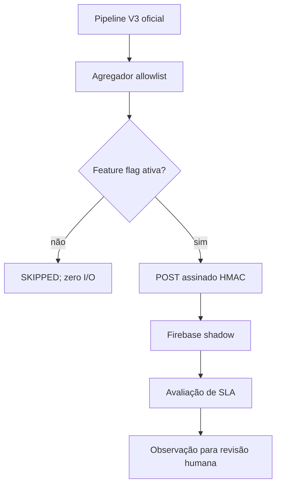

# Rollout Firebase em shadow mode — WMGJ

## Decisão arquitetural

Sheets/Apps Script V3 continua como sistema oficial. O Firebase é uma réplica observacional, sem escrita de retorno, sem cutover e sem dados clínicos ou identificáveis. A implantação mede paridade, SLA, rastreabilidade e utilidade antes de qualquer mudança de autoridade.

## Fluxo implantado

## Propriedades de ativação

Configurar somente em ambiente de teste:

| Propriedade | Regra |
|---|---|
| `WMGJ_FIREBASE_SHADOW_ENABLED` | `true` somente após aprovação do gate G1 |
| `WMGJ_FIREBASE_SHADOW_ENDPOINT` | URL HTTPS exata da Function de homologação |
| `WMGJ_FIREBASE_SHADOW_HMAC_SECRET` | segredo aleatório com 32+ caracteres, igual ao Secret Manager |
| `WMGJ_FIREBASE_SHADOW_TENANT_ID` | identificador opaco |
| `WMGJ_FIREBASE_SHADOW_SITE_ID` | identificador opaco opcional |

No Firebase, `SHADOW_INGEST_ENABLED=true` e `SHADOW_INGEST_HMAC_SECRET` devem existir apenas em homologação. Nenhum valor secreto entra no GitHub, Sheets, logs ou documentação.

## Sequência segura

1. Implantar Functions, Rules e índices em projeto Firebase exclusivo de homologação.
2. Executar testes sintéticos e confirmar que o endpoint rejeita payload extra, assinatura inválida e `productionCutoverRequested=true`.
3. Ativar primeiro o lado Firebase; manter Apps Script desativado.
4. Executar `testarFirebaseShadowWMGJ()`: deve retornar `externalWrites=0`.
5. Cadastrar endpoint, segredo, tenant e unidade nas ScriptProperties.
6. Ativar a ponte Apps Script por uma janela de observação definida.
7. Comparar diariamente contagens, idade da fila, erros, cobertura de evidência e cadeia de auditoria.
8. Se houver divergência, desligar a flag Apps Script. O sistema oficial continua operando.

O workflow `deploy-firebase-shadow.yml` é manual, fixa o commit, exige o ambiente protegido `firebase-shadow-staging`, compara o projeto solicitado com a allowlist e autentica por Workload Identity Federation. O padrão é `dry_run=true`. A implantação só fica alcançável quando a variável protegida `ENABLE_FIREBASE_SHADOW_DEPLOY` for exatamente `true`; mesmo assim, a ingestão nasce desabilitada no backend.

## Critérios mínimos do piloto

- 14 ciclos consecutivos sem interferência no pipeline V3;
- 100% dos snapshots com contrato e hash válidos;
- nenhuma ocorrência de dado proibido;
- nenhuma duplicidade material após reenvio;
- falhas shadow sem alteração do resultado oficial;
- observações de aprendizado revisadas por pessoa;
- rollback testado apenas desligando a feature flag;
- decisão documentada de continuar, corrigir ou encerrar o piloto.

## Cutover

Não existe cutover neste PR. Para tornar o Firebase fonte oficial será necessário outro PR, revisão de segurança e privacidade, reconciliação integral, backup/restore testado e aprovação nominal de operação, auditoria e governança.
