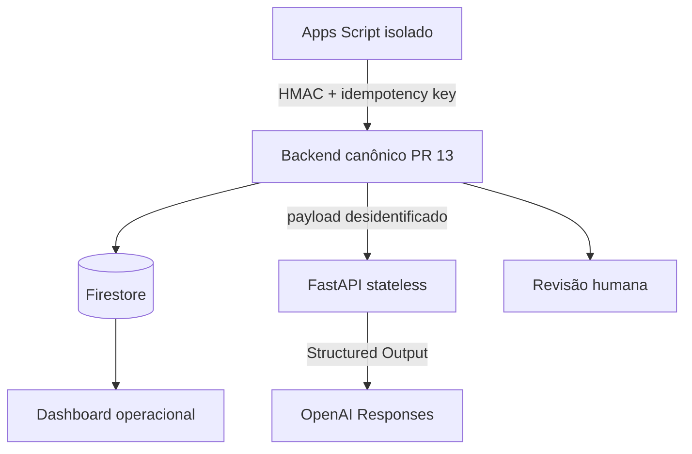

# Arquitetura e invariantes

> **Owner:** Backend Owner e Platform Owner, com Security e Data Owners
> **Status:** `CONTROLLED_DRAFT` — arquitetura para homologação sintética; dispatch real e uso clínico bloqueados
> **Effective:** 2026-08-26 para desenvolvimento local e staging dry-run
> **Review:** a cada mudança de contrato, tenant, estado, fonte de verdade ou finalidade; trimestralmente
> **Supersedes:** arquitetura não controlada anterior deste kernel

## Separação de responsabilidades

| Camada | Responsabilidade | Não pode fazer |
|---|---|---|
| Apps Script | ler inbox preparada, criar referência/hash, manter outbox e enviar lotes curtos | escrever com Admin SDK, aprovar decisão crítica ou guardar conteúdo clínico bruto |
| FastAPI | validar HMAC/nonce/contrato e solicitar análise estruturada à OpenAI | persistir Firestore, aprovar decisão, aceitar dado clínico identificável ou ocultar falha |
| Firestore/backend-alvo | idempotência transacional, projeções, leases, auditoria e aprovações | permitir escrita cliente em auditoria privilegiada |
| OpenAI | extração/revisão estruturada, com saída versionada | fechar caso, negar cobertura, decidir tratamento ou aprovar pagamento |
| Dashboard | situação operacional e drill-down | substituir evidência ou decisão formal |

O contrato entre as camadas não é “o PR #13” em abstrato. Commit, schema, headers, enums, receipt e testes estão controlados em [`PR13_CONTRACT_COMPATIBILITY.md`](PR13_CONTRACT_COMPATIBILITY.md).

## Fonte de verdade por fase

| Fase | Evidência primária | Estado operacional | Auditoria canônica | Regra de divergência |
|---|---|---|---|---|
| staging sintético | fixture versionada | planilha exclusiva do kernel | receipts/eventos sintéticos | falha bloqueia o gate |
| transição/dual write | documento original em fonte autorizada | planilha WMGJ para domínio ainda não cortado | Firestore para eventos aceitos | documento prevalece; reconciliar antes de avançar |
| pós-cutover de domínio | documento original | Firestore para domínio formalmente aceito | Firestore + export/log de auditoria aprovado | nunca sobrescrever evidência; corrigir por novo evento |

Dashboard e relatório são projeções. Código versionado não prova deploy; deploy não prova execução; execução sem receipt/audit event não prova aceitação canônica.

## Invariantes

1. O cursor avança somente depois que a outbox foi persistida.
2. A outbox guarda `sourceRef`, versão, hash e metadados mínimos; nunca conteúdo clínico bruto.
3. Toda falha possui código, `traceId`, tratamento retry/DLQ e log sanitizado.
4. `ack` exige `leaseToken` válido e versão esperada.
5. Mudança do `snapshotHash` invalida aprovação anterior.
6. `CLOSED` exige evidências, reconciliação e aprovações aplicáveis.
7. O Apps Script não executa escrita privilegiada no Firestore.
8. Deploy não instala gatilhos nem processa dados.
9. Regras são dados declarativos allowlisted; não existe `eval`, `Function` dinâmico ou JavaScript remoto.
10. Homologação não recebe dados reais; modo clínico inicia desabilitado.
11. O backend-alvo deve manter idempotência, autorização, replay protection e limite de custo; no baseline do PR #13 essas garantias permanecem condicionadas aos testes e lacunas de [`PR13_CONTRACT_COMPATIBILITY.md`](PR13_CONTRACT_COMPATIBILITY.md). O cache de nonce do FastAPI é apenas defesa local por instância.
12. Falha da IA não bloqueia a captura nem altera evidência: gera estado explícito e revisão humana.
13. Risco do sistema de IA, risco do caso e severidade do achado são armazenados e governados separadamente.
14. Papel, alçada e credencial são verificados no backend; valor informado pelo cliente não concede autoridade.
15. Correção e reabertura referenciam a versão anterior (`supersedes`) e nunca reescrevem história.
16. Dado real permanece bloqueado até o modelo de proteção de dados e o gate de finalidade serem aprovados.

## Máquinas de estado independentes

### Documento/caso

```text
RECEIVED -> CLASSIFIED -> EXTRACTED -> NORMALIZED
NORMALIZED -> PENDING_EVIDENCE | PENDING_HUMAN_REVIEW
PENDING_EVIDENCE -> PENDING_HUMAN_REVIEW
PENDING_HUMAN_REVIEW -> VALIDATED | BLOCKED | CANCELLED
VALIDATED -> CLOSED | BLOCKED
```

`CLOSED` é terminal. Reabertura cria uma nova revisão, não altera retroativamente a versão fechada.

O pacote de evidências e aprovações de `CLOSED` é específico por domínio; consulte a matriz de fechamento do plano de governança. `CANCELLED` integra o candidato versionado do backend e deve atravessar a integração sem conversão silenciosa para `BLOCKED` ou `CLOSED`.

### Fila

```text
READY -> LEASED -> SUCCEEDED | RETRY_WAIT | DEAD_LETTER
RETRY_WAIT -> READY
```

### Revisão

```text
PENDING -> APPROVED | REJECTED | CHANGES_REQUESTED | EXPIRED
```

Decisões são append-only e a IA nunca é aprovadora.

`CHANGES_REQUESTED` e `EXPIRED` integram o candidato versionado do backend e devem atravessar a integração com a semântica exata. Isso não libera dispatch: receipt forte, replay/rotação de chave, autorização por unidade e testes contratuais ainda são gates bloqueantes.

## Crescimento contínuo

```text
OBSERVE -> FINDING -> PROPOSAL -> REPLAY/EVAL
-> HUMAN_APPROVAL -> CANARY -> PROMOTE | ROLLBACK
```

Versões de algoritmo usam `DRAFT`, `TESTING`, `APPROVED`, `CANARY`, `ACTIVE`, `RETIRED` ou `ROLLED_BACK`. Toda decisão registra versão do algoritmo, regras, prompt e schema.

Promoção depende de [`SLO_ERROR_BUDGET_DR.md`](SLO_ERROR_BUDGET_DR.md), da matriz RACI e, quando houver impacto médico, do safety case clínico. Fixtures sintéticas demonstram contrato, não eficácia clínica.

## Topologia de integração



O FastAPI não recebe credenciais do Firebase e não escreve em coleções. O backend chamador deve adquirir um lock distribuído por `inputHash + promptVersion + model`, registrar custo/resultado e rejeitar repetição antes da chamada. O cache de nonce mantido em memória pelo FastAPI não substitui esse lock em uma implantação com múltiplas instâncias.

## Trilha mínima de decisão

Além do evento básico, decisões e execuções de IA precisam preservar:

```text
deploymentCommit, configHash, provider, modelVersion,
inputHash, outputHash, ruleSetVersion, promptVersion, schemaVersion,
confidenceOrCalibration, usage, cost, evidenceRefsWithVersionAndHash,
identityProvider, authenticationAssurance, canonicalRole,
snapshotHash, approvalPolicyVersion, approvalIds, reviewedAt,
supersedesEventId, retentionClass
```

Firestore com Admin SDK não é imutabilidade por si só. Retenção, acesso privilegiado, proteção contra adulteração e exportação independente precisam de controle e teste próprios.
